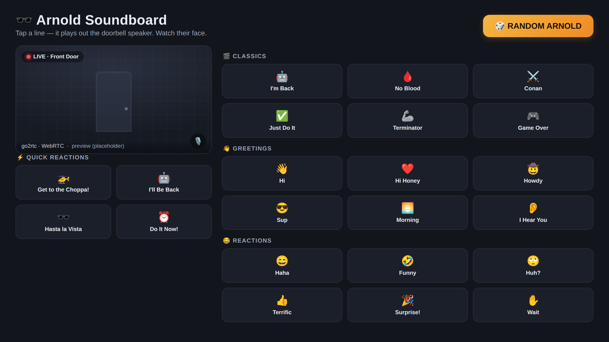

# 🕶️ Arnold Doorbell — *"Get to the choppa!"*

> A Home Assistant soundboard that plays **Arnold Schwarzenegger one-liners out of a Reolink video doorbell's own speaker** — on demand, from your phone, while you watch the visitor's face on the live feed.

Part home-automation project, part love letter to the **eBaum's World soundboards** of the early 2000s. Somebody's at the door? *"WHO IS YOUR DADDY, AND WHAT DOES HE DO?"*

<p align="center">
  
</p>

<sub>The soundboard in Home Assistant — live doorbell feed, one-tap Arnold, and the full library. (UI preview; the live tile is a placeholder.)</sub>

---

## What it does

- 📱 A dedicated **soundboard dashboard** in Home Assistant: live doorbell video up top, a grid of one-tap Arnold clips below.
- 🔊 Tapping a clip streams the audio **out of the doorbell's built-in speaker** — not a house speaker, the doorbell itself.
- 🎲 **Random** button, curated categories (Classics / Greetings / Reactions), and a searchable dropdown of the full **432-clip** library.
- 🎥 Live feed stays visible while you trigger clips, so you can watch them jump.
- 🗣️ Coexists with the doorbell's normal **two-way intercom** (they share one audio channel — see [Design notes](#design-notes--gotchas)).

No Reolink cloud. No mobile-vendor SDK. No custom firmware. Just ONVIF, `go2rtc`, and a pile of `ffmpeg`.

---

## Why

Because someone rings your doorbell and it should be able to answer in Arnold's voice.

Reolink doesn't expose a simple "play this audio file" API — but every modern Reolink with a speaker has an **ONVIF two-way audio backchannel**, and go2rtc can push arbitrary audio down it. So: a 400+ clip Arnold soundboard, on the front door, triggered from your phone while you watch the live feed.

---

## How it works

```
  [ HA dashboard button ]
           │  tap
           ▼
  script.arnold_play(clip)                  Home Assistant
           │  rest_command (HTTP POST)
           ▼
  go2rtc  /api/ffmpeg?dst=doorbell_talk&file=…/clip.mp3
           │  opens ONVIF two-way audio backchannel
           ▼
  [ Reolink doorbell speaker ]  🔊  "HASTA LA VISTA, BABY"
```

- **`go2rtc`** (already bundled inside [Frigate](https://frigate.video)) exposes an ONVIF `onvif://` stream for the doorbell. That stream carries the **backchannel** — the send-audio-to-camera path.
- A Home Assistant **`rest_command`** hits go2rtc's `/api/ffmpeg` endpoint with a clip path; go2rtc transcodes and pushes it down the backchannel.
- A tiny **`script` + `input_select` + `input_text`** package drives the whole thing; the dashboard is just buttons calling the script with different `clip` values.

### The two engineering problems worth knowing about

**1. The tail got cut off.** First working test played `"Get to the choppa!"` … but go2rtc tears the backchannel down the instant the file's audio data ends, so the last word never finished traveling to the speaker. **Fix:** pre-pad every clip with a short lead-in + **trailing silence** (`ffmpeg` `adelay` + `apad`) so the real audio fully flushes before the channel closes. See [`scripts/pad-clips.sh`](scripts/pad-clips.sh).

**2. Don't duplicate the library.** The padded clips have to live somewhere go2rtc can read by path. Copying them into the HA or Frigate config dirs bloats backups; HA won't serve them via symlink (`follow_symlinks=False`); on-the-fly padding through the API wasn't supported by the go2rtc build. **Fix:** store the ~8 MB of padded clips on the **NVR storage volume** the Frigate container already mounts — negligible footprint, read straight off disk (and page-cached in RAM anyway).

---

## Stack

| Layer | Tech |
|------|------|
| Orchestration / UI | [Home Assistant](https://www.home-assistant.io/) (packages, scripts, Lovelace) |
| Audio transport | [`go2rtc`](https://github.com/AlexxIT/go2rtc) (bundled in Frigate) — ONVIF two-way audio |
| NVR / camera glue | [Frigate](https://frigate.video) |
| Hardware | Reolink Video Doorbell WiFi (D340W) |
| Audio prep | `ffmpeg` |
| Dashboard card | [frigate-hass-card](https://github.com/dermotduffy/frigate-hass-card) for the live feed |

---

## Setup (overview)

Full walkthrough in [`docs/setup.md`](docs/setup.md). The short version:

1. **Get the clips.** Run [`scripts/arnold-download.sh`](scripts/arnold-download.sh) (sources noted below). The mp3s are **not** committed to this repo — see [Legal](#legal--credits).
2. **Pad them.** `scripts/pad-clips.sh <src_dir> <dst_dir>` → padded clips onto a volume your go2rtc/Frigate container can read.
3. **Add the go2rtc backchannel stream.** Drop the `doorbell_talk` stream from [`frigate/config.snippet.yml`](frigate/config.snippet.yml) into your Frigate `go2rtc:` config.
4. **Install the HA package.** Copy [`homeassistant/packages/arnold.yaml.example`](homeassistant/packages/arnold.yaml.example) → your `packages/arnold.yaml`, fill in your host/paths.
5. **Build the dashboard.** Generate it with [`scripts/generate_dashboard.py`](scripts/generate_dashboard.py) or adapt [`homeassistant/dashboard-arnold.example.yaml`](homeassistant/dashboard-arnold.example.yaml).
6. **Test:** `curl -X POST "http://<go2rtc>:1984/api/ffmpeg?dst=doorbell_talk&file=/path/to/choppa.mp3"` → the doorbell should speak.

---

## Design notes / gotchas

- **One audio channel.** The soundboard and human intercom (Reolink app *or* the live-card mic) share the doorbell's single audio-in path — mutually exclusive at any instant. Keeping the backchannel "warm" to reduce first-tap latency (~1–1.5 s) is possible, but a *persistent* warm session can block the human talk feature. This build leaves it cold-on-demand to keep the intercom reliable.
- **Latency is the backchannel handshake**, not disk I/O. The clips are tiny and cached; NVMe won't help. The real lever is warming the ONVIF session.
- **Keep it family-safe at the door.** The library has some… spicy Arnold. The dashboard front-loads clean clips and tucks the rest into the full-library dropdown.

---

## Legal & credits

**This project stands on other people's shoulders — cite them:**

- 🙏 **The core technique** — sending arbitrary audio to a Reolink camera over ONVIF two-way audio via go2rtc — is adapted from **mayerwin's gist**: <https://gist.github.com/mayerwin/19f6090595d4f7ce05f264e0b10b0c42>. This project would not exist without it.
- 🛠️ **[go2rtc](https://github.com/AlexxIT/go2rtc)** by AlexxIT — the workhorse doing the actual two-way audio.
- 🎥 **[Frigate](https://frigate.video)** — which bundles go2rtc and made this a config change instead of a new service.
- 🏠 **[Home Assistant](https://www.home-assistant.io/)** and the **[frigate-hass-card](https://github.com/dermotduffy/frigate-hass-card)**.
- 🕹️ **Spiritual credit to the classic [eBaum's World Arnold Schwarzenegger Soundboard](https://www.ebaumsworld.com/soundboards/arnold-schwarzenegger-soundboard-1/1876/)** — and the countless other eBaum's boards that defined an era of internet dumb fun. This is that, on a doorbell.
- 📞 **Inspiration** — the golden age of soundboard prank calls, e.g. [this Arnold prank call](https://www.ebaumsworld.com/videos/arnold-prank-call/45855/). Now the "call" is whoever walks up to the door.
- 🎙️ **Arnold audio clips** are **© their respective rights holders** (the films / Arnold Schwarzenegger). They are **not redistributed in this repo** — supply your own for personal use. Don't ship them commercially.

**Code in this repo is MIT-licensed** (see [`LICENSE`](LICENSE)). The clips are not mine to license.

---

## Status

Working in production on one very confused neighborhood. PRs welcome; better one-liners *strongly* encouraged.

*"I'll be back."* — and now, so is the doorbell.
