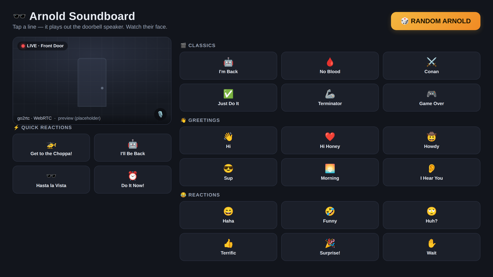

# 🕶️ Arnold Doorbell — *"Get to the choppa!"*

> A Home Assistant soundboard that plays **Arnold Schwarzenegger one-liners out of a Reolink video doorbell's own speaker** — on demand, from your phone, while you watch the visitor's face on the live feed.

Part home-automation project, part love letter to the **eBaum's World soundboards** of the early 2000s. Somebody's at the door? *"WHO IS YOUR DADDY, AND WHAT DOES HE DO?"*

<p align="center">
  
</p>

<sub>The soundboard in Home Assistant — live doorbell feed, one-tap Arnold, and the full library. (UI preview; the live tile is a placeholder.)</sub>

---

## What it does

- 📱 A dedicated **soundboard dashboard** in Home Assistant: live doorbell video up top, a grid of one-tap Arnold clips below.
- 🔊 Tapping a clip streams the audio **out of the doorbell's built-in speaker** — not a house speaker, the doorbell itself.
- 🎲 **Random** button, curated categories (Classics / Greetings / Reactions), and a searchable dropdown of the full **432-clip** library.
- 🎥 Live feed stays visible while you trigger clips, so you can watch them jump.
- 🗣️ Coexists with the doorbell's normal **two-way intercom** (they share one audio channel — see [Design notes](#design-notes--gotchas)).

No Reolink cloud. No mobile-vendor SDK. No custom firmware. Just ONVIF, `go2rtc`, and a pile of `ffmpeg`.

---

## Why

Because someone rings your doorbell and it should be able to answer in Arnold's voice.

Reolink doesn't expose a simple "play this audio file" API — but every modern Reolink with a speaker has an **ONVIF two-way audio backchannel**, and go2rtc can push arbitrary audio down it. So: a 400+ clip Arnold soundboard, on the front door, triggered from your phone while you watch the live feed.

---

## How it works

```
  [ HA dashboard button ]
           │  tap
           ▼
  script.arnold_play(clip)                  Home Assistant
           │  rest_command (HTTP POST)
           ▼
  go2rtc  /api/ffmpeg?dst=doorbell_talk&file=…/clip.mp3
           │  opens ONVIF two-way audio backchannel
           ▼
  [ Reolink doorbell speaker ]  🔊  "HASTA LA VISTA, BABY"
```

- **`go2rtc`** (already bundled inside [Frigate](https://frigate.video)) exposes an ONVIF `onvif://` stream for the doorbell. That stream carries the **backchannel** — the send-audio-to-camera path.
- A Home Assistant **`rest_command`** hits go2rtc's `/api/ffmpeg` endpoint with a clip path; go2rtc transcodes and pushes it down the backchannel.
- A tiny **`script` + `input_select` + `input_text`** package drives the whole thing; the dashboard is just buttons calling the script with different `clip` values.

### The three engineering problems worth knowing about

**1. The tail got cut off.** First working test played `"Get to the choppa!"` … but go2rtc tears the backchannel down the instant the file's audio data ends, so the last word never finished traveling to the speaker. **Fix:** pre-pad every clip with a short lead-in + **trailing silence** (`ffmpeg` `adelay` + `apad`) so the real audio fully flushes before the channel closes. See [`scripts/pad-clips.sh`](scripts/pad-clips.sh).

**2. Don't duplicate the library — but don't park it in camera storage either.** The padded clips have to live somewhere go2rtc can read by path. Copying them into the HA or Frigate config dirs bloats backups; HA won't serve them via symlink (`follow_symlinks=False`); on-the-fly padding through the API wasn't supported by the go2rtc build.

An earlier version of this README said to put the ~8 MB of clips on the **NVR storage volume Frigate already mounts**. **Don't.** That volume is camera storage — when it gets migrated to a different disk, the clips don't come with it and the entire soundboard goes silent. Worse, it fails *invisibly* (see gotcha #3).

**Fix:** keep the clips in their own directory and mount it read-only into the Frigate container at a path outside `/media/frigate`:

```yaml
frigate:
  volumes:
    - /path/to/arnold/clips:/arnold-clips:ro
```

Then reference `/arnold-clips/<clip>.mp3` in the `rest_command`. Camera storage can now be moved freely without touching the soundboard.

**3. A missing clip returns HTTP 200.** go2rtc answers `200 OK` whether the file exists or not — verified against both a bogus path and a bogus URL. Home Assistant therefore logs every tap as successful while nothing plays, and `script.arnold_play` shows a clean run in the trace. If your soundboard ever goes quiet with no errors anywhere, **check the clips are actually where go2rtc expects them** before debugging anything else. The optional [`arnold-session`](arnold-session/) sidecar exists partly to turn this into a real 404.

---

## Stack

| Layer | Tech |
|------|------|
| Orchestration / UI | [Home Assistant](https://www.home-assistant.io/) (packages, scripts, Lovelace) |
| Audio transport | [`go2rtc`](https://github.com/AlexxIT/go2rtc) (bundled in Frigate) — ONVIF two-way audio |
| NVR / camera glue | [Frigate](https://frigate.video) |
| Hardware | Reolink Video Doorbell WiFi (D340W) |
| Audio prep | `ffmpeg` |
| Dashboard card | [frigate-hass-card](https://github.com/dermotduffy/frigate-hass-card) for the live feed |

---

## Setup (overview)

Full walkthrough in [`docs/setup.md`](docs/setup.md). The short version:

1. **Get the clips.** Run [`scripts/arnold-download.sh`](scripts/arnold-download.sh) (sources noted below). The mp3s are **not** committed to this repo — see [Legal](#legal--credits).
2. **Pad them.** `scripts/pad-clips.sh <src_dir> <dst_dir>` → padded clips onto a volume your go2rtc/Frigate container can read.
3. **Add the go2rtc backchannel stream.** Drop the `doorbell_talk` stream from [`frigate/config.snippet.yml`](frigate/config.snippet.yml) into your Frigate `go2rtc:` config.
4. **Install the HA package.** Copy [`homeassistant/packages/arnold.yaml.example`](homeassistant/packages/arnold.yaml.example) → your `packages/arnold.yaml`, fill in your host/paths.
5. **Build the dashboard.** Generate it with [`scripts/generate_dashboard.py`](scripts/generate_dashboard.py) or adapt [`homeassistant/dashboard-arnold.example.yaml`](homeassistant/dashboard-arnold.example.yaml).
6. **Test:** `curl -X POST "http://<go2rtc>:1984/api/ffmpeg?dst=doorbell_talk&file=/arnold-clips/choppa.mp3"` → the doorbell should speak. **A 200 here means nothing** (see gotcha #3) — trust your ears, not the status code.
7. **Optional:** add the [`arnold-session`](arnold-session/) sidecar for ~0.43s first-tap latency and a real 404 on a missing clip.

---

## Design notes / gotchas

- **One audio channel.** The soundboard and human intercom (Reolink app *or* the live-card mic) share the doorbell's single audio-in path — mutually exclusive at any instant. A *persistent* warm session is the risk here: reports exist of an open backchannel keeping the ring light on, disabling the chime, and stranding the doorbell in 2-way mode until Frigate restarts. The optional [`arnold-session`](arnold-session/) sidecar takes a middle path — warm **on demand**, dropped after 90s idle — and measurement shows it never holds `:8000` at all (it holds a `:554` video stream), so that failure mode does not appear to apply. Confirm on your own hardware.
- **Latency is the backchannel handshake**, not disk I/O. The clips are tiny and cached; NVMe won't help. Measured: **~1.55s cold**, **~0.72s** with a session held, **~0.43s** for the first clip when pre-warmed on the doorbell press. ffmpeg spawn is only ~0.15s of it, and the camera answers ONVIF in ~90ms — the rest is the RTSP handshake.
- **The handshake cost is architectural, not tunable.** go2rtc's `dst=` API spawns ffmpeg and does a full RTSP `DESCRIBE/SETUP/PLAY` with `Require: backchannel` on *every* call. A persistent backchannel relay is an [open feature request](https://github.com/AlexxIT/go2rtc/issues/1899). Holding a session is the only workaround available today.
- **Set `#backchannel=0` on the doorbell's other sources.** If the same camera's video sources also negotiate the backchannel, they contend with `doorbell_talk`, which go2rtc documents as blocking backchannel access. Worth fixing for correctness — though in our testing it made **no measurable difference to latency** (1.80s → 1.74s cold, within noise).
- **Things that sound like they'd help and don't:**
  - *Pre-transcoding clips to G.711* to skip mp3 decode: **no effect.** A 0.2s clip costs the same as a 5s one — the cost is fixed setup, independent of format and duration.
  - *An audio-only keepalive* (`/api/stream.aac`): does not hold an RTSP session; latency decays straight back to cold.
  - *Serving clips to go2rtc over HTTP* instead of by path: **unverifiable**, because a bogus URL returns 200 exactly like a bogus path (gotcha #3).
- **Want genuinely lower latency? That's [neolink](https://github.com/thirtythreeforty/neolink).** It speaks Reolink's native Baichuan protocol on port 9000 and reportedly reaches Reolink-app talkback latency. Caveats worth weighing: it's reverse-engineered and firmware-sensitive, the documented install needs `apt install` inside the Frigate container (which does not survive container recreation — you end up maintaining a custom image), and if Home Assistant's Reolink integration is already holding a Baichuan connection, a second client can contend with it. It solves *live intercom* latency; for firing pre-recorded clips, a warm session already gets you to ~0.43s.
- **Keep it family-safe at the door.** The library has some… spicy Arnold. The dashboard front-loads clean clips and tucks the rest into the full-library dropdown.

---

## Legal & credits

**This project stands on other people's shoulders — cite them:**

- 🙏 **The core technique** — sending arbitrary audio to a Reolink camera over ONVIF two-way audio via go2rtc — is adapted from **mayerwin's gist**: <https://gist.github.com/mayerwin/19f6090595d4f7ce05f264e0b10b0c42>. This project would not exist without it.
- 🛠️ **[go2rtc](https://github.com/AlexxIT/go2rtc)** by AlexxIT — the workhorse doing the actual two-way audio.
- 🎥 **[Frigate](https://frigate.video)** — which bundles go2rtc and made this a config change instead of a new service.
- 🏠 **[Home Assistant](https://www.home-assistant.io/)** and the **[frigate-hass-card](https://github.com/dermotduffy/frigate-hass-card)**.
- 🕹️ **Spiritual credit to the classic [eBaum's World Arnold Schwarzenegger Soundboard](https://www.ebaumsworld.com/soundboards/arnold-schwarzenegger-soundboard-1/1876/)** — and the countless other eBaum's boards that defined an era of internet dumb fun. This is that, on a doorbell.
- 📞 **Inspiration** — the golden age of soundboard prank calls, e.g. [this Arnold prank call](https://www.ebaumsworld.com/videos/arnold-prank-call/45855/). Now the "call" is whoever walks up to the door.
- 🎙️ **Arnold audio clips** are **© their respective rights holders** (the films / Arnold Schwarzenegger). They are **not redistributed in this repo** — supply your own for personal use. Don't ship them commercially.

**Code in this repo is MIT-licensed** (see [`LICENSE`](LICENSE)). The clips are not mine to license.

---

## Status

Working in production on one very confused neighborhood. PRs welcome; better one-liners *strongly* encouraged.

*"I'll be back."* — and now, so is the doorbell.
